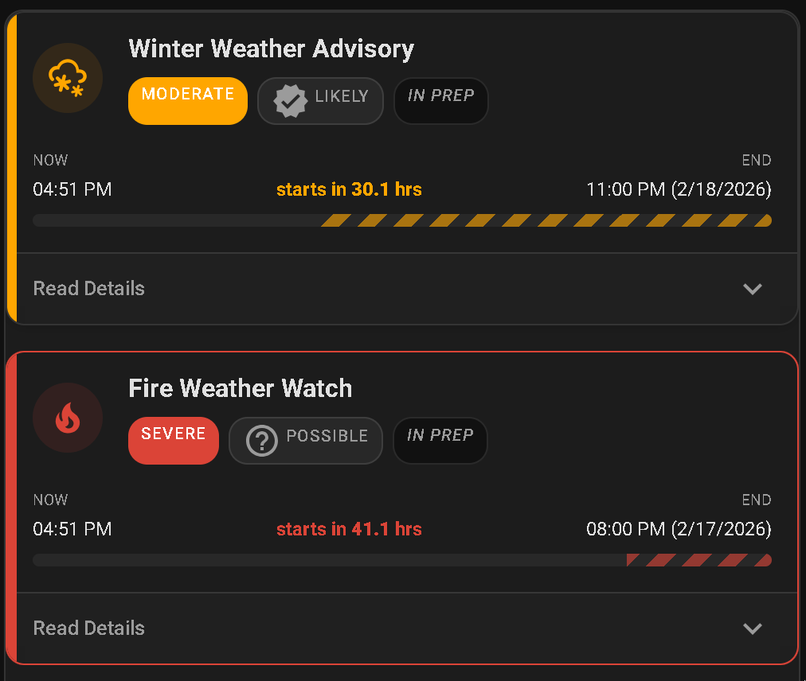
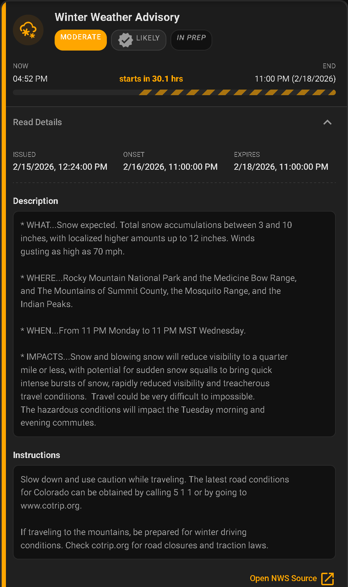
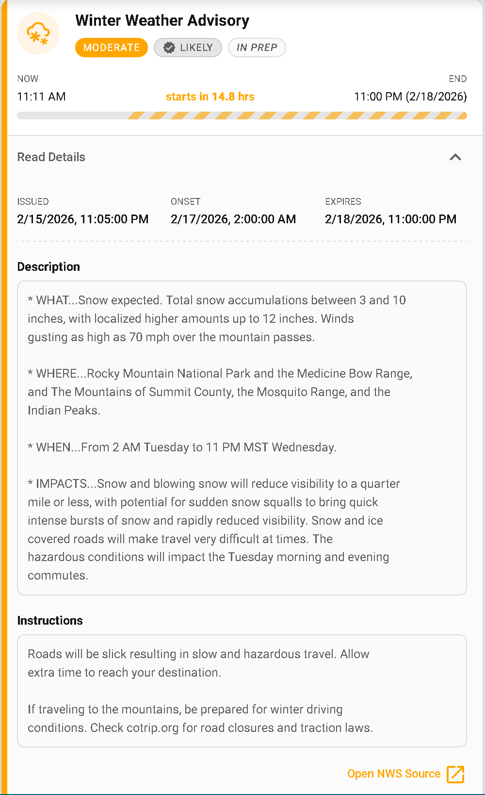

# NWS Alerts Card

A custom Home Assistant Lovelace card for displaying NWS (National Weather Service) weather alerts with severity indicators, progress bars, and expandable details.

| Dark theme | Light theme |
|:---:|:---:|
|  |  |
|  |  |

## Features

- Severity-based color coding with animated borders for extreme/severe alerts
- Progress bars showing elapsed/remaining time for each alert
- Expandable details with description, instructions, and NWS source link
- Zone-based alert filtering
- Card picker integration (add from HA UI)
- Shadow DOM — no style conflicts, full HA theme support

## Prerequisites

- [NWS Alerts integration](https://github.com/finity69x2/nws_alerts) v6.1+

## Installation

### HACS (recommended)

1. Open HACS in Home Assistant
2. Go to **Frontend** → three-dot menu → **Custom repositories**
3. Add this repository URL, category **Lovelace**
4. Search for "NWS Alerts Card" and install
5. Refresh your browser

### Manual

1. Download `nws-alerts-card.js` from the [latest release](../../releases/latest)
2. Copy to `config/www/nws-alerts-card.js`
3. Add the resource in **Settings → Dashboards → Resources** (requires Advanced Mode enabled in your user profile):
   - URL: `/local/nws-alerts-card.js`
   - Type: JavaScript Module

## Configuration

| Option   | Type     | Required | Default | Description                        |
|----------|----------|----------|---------|------------------------------------|
| `entity` | string   | yes      | —       | Entity ID (e.g. `sensor.nws_alerts_alerts`) |
| `title`  | string   | no       | —       | Card header title                  |
| `zones`  | string[] | no       | —       | Filter alerts to specific NWS zone codes (omit to use all configured zones) |
| `animations` | boolean | no    | `true`  | Enable animated borders, progress bars, and other visual animations |

### Basic

```yaml
type: custom:nws-alerts-card
entity: sensor.nws_alerts_alerts
```

### With title and zone filtering

```yaml
type: custom:nws-alerts-card
entity: sensor.nws_alerts_alerts
title: Weather Alerts
zones:
  - COC059
  - COZ039
  - COZ239
```

## NWS Alerts Integration Setup

This card requires the [NWS Alerts](https://github.com/finity69x2/nws_alerts) custom integration to provide the `sensor.nws_alerts_alerts` entity.

1. Install via HACS: **Integrations** → **Explore & Download Repositories** → search "NWS Alerts"
2. Restart Home Assistant
3. **Settings → Devices & Services → Add Integration** → search "NWS Alerts"
4. Enter your zone/county codes (find yours at [alerts.weather.gov](https://alerts.weather.gov/))

> **Note**: Zone codes must be comma-delimited with **no spaces** (e.g. `COC059,COZ039,COZ239`). Adding spaces after commas causes the integration to silently return no alerts.

## Development

```bash
npm install
npm run build     # bundle → dist/nws-alerts-card.js
npm run watch     # bundle with file watching
npm run lint      # TypeScript type-check
```

### Local HA dev container

```bash
npm run build
docker compose -f .docker/docker-compose.yml up
```

Access Home Assistant at http://localhost:8123. The card JS is volume-mounted read-only — rebuild on the host and refresh the browser to see changes.

After the HA onboarding flow, add the card resource via **Settings → Dashboards → Resources** (URL: `/local/nws-alerts-card.js`, type: JavaScript Module). Then add the card to any dashboard — it will appear in the card picker as "NWS Alerts Card".
